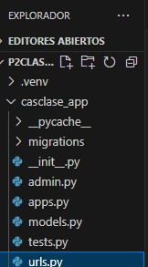
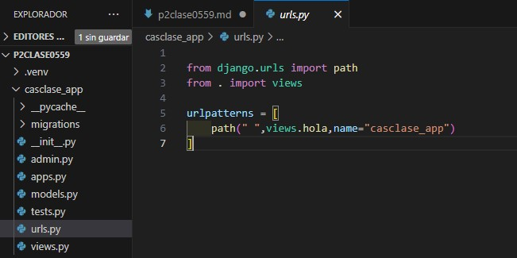
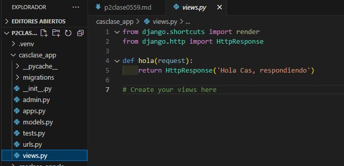
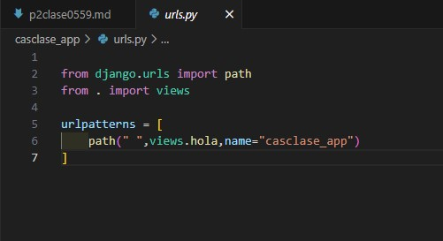

- Crear aplicaciones casclase_app
- comando --> python manage.py startapp casclase_app
- creamos el archivo urls.py en casclase0559
- 
- En setting.py p2clase0559
- 
- en urls.py casclase_app
- 
- en views.py en casclase_app
- 
- en urls.py casclase_app
- 